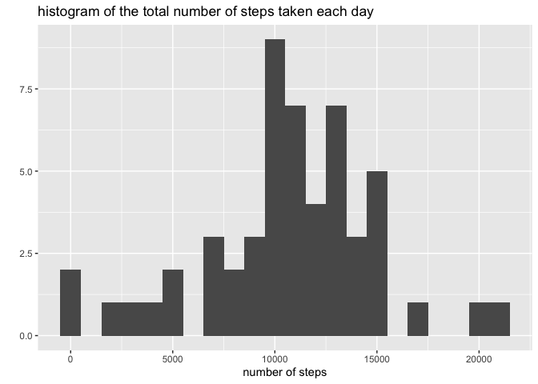
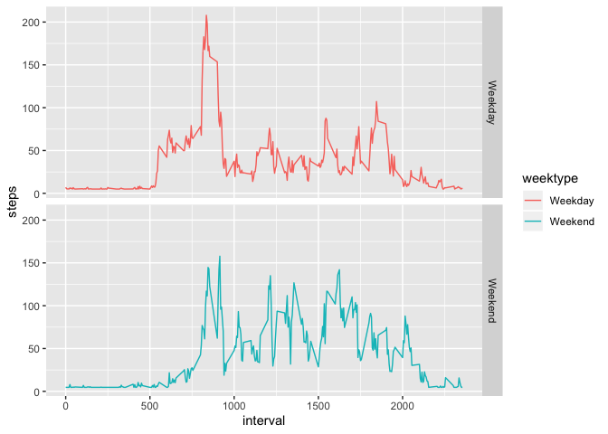

## Loading and preprocessing the data
1. Read the data

```r
dat = read.csv('./activity.csv')
```
2. Transform the data and get the total number of steps per day. There are 8 days
that the records are missing and they are ignored.

```r
activity=aggregate(steps~date, dat, sum)
summary(activity$steps)
```

```
##    Min. 1st Qu.  Median    Mean 3rd Qu.    Max. 
##      41    8841   10765   10766   13294   21194
```

## What is mean total number of steps taken per day?

```r
stepsmean = mean(activity$steps, na.rm = T)
stepsmedian = median(activity$steps, na.rm = T)
library(ggplot2)
qplot(activity$steps,binwidth=1000,
      main='histogram of the total number of steps taken each day', 
      xlab='number of steps')
```

<!-- -->


So the mean for totol number of steps taken per day is 10766.19 and median.
is 10765


## What is the average daily activity pattern?

Transform the data and take avarage steps for each interval

```r
interval = aggregate(steps~interval, dat, mean)
```

Creat a plot

```r
plot(interval$interval, interval$steps, type = 'l', 
     main="average number of steps during the day", 
     xlab="interval in a day", 
     ylab="Average number of steps")
```

<!-- -->


## Imputing missing values

Impute the missing values with the average steps for each interval

```r
impute=mean(dat$steps, na.rm = T)
newdat=dat
newdat$steps[is.na(dat$steps)]=impute
activitynew=aggregate(steps~date, newdat, sum)
library(ggplot2)
qplot(activitynew$steps,binwidth=1000,
      main='histogram of the total number of steps taken each day', 
      xlab='number of steps')
```

<!-- -->

```r
newstepsmean = mean(activitynew$steps)
newstepsmedian = median(activitynew$steps)
```
So the mean for totol number of steps taken per day after imputing 
is 10766.19 compared to 10766.19 without imputing and the median is 10766.19 
vs 10765. They are the same except for the median as I used mean to impute.


## Are there differences in activity patterns between weekdays and weekends?


Create a new column to assign the day('Monday', 'Tuesday',...) in a week and 
creat another column to assgn 'weekday' or 'weekend'

```r
newdat$week=weekdays(as.Date(newdat$date,"%Y-%m-%d"))
newdat$weektype=ifelse(newdat$week=='Sunday'|newdat$week=='Saturday',
                            'Weekend','Weekday')
activityweekend=aggregate(steps~interval+weektype, newdat, mean)
qplot(interval, steps, data = activityweekend, geom = 'line' , facets = 
              weektype~., color=weektype)
```

<!-- -->
